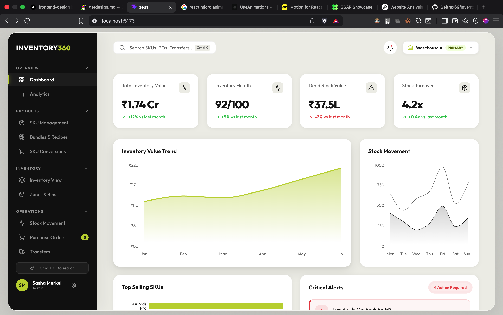

<div align="center">


# 🏭 Inventory360 — Zeus ERP

### A premium, modular Inventory & Warehouse Management ERP frontend  
built with React 18, Zustand global state, and a custom industrial design system.

[Live Demo](#) · [Report Bug](https://github.com/Geltrax69/Inventory-360-Management-UI/issues)

</div>

---

## 📸 Screenshots

> Dashboard with KPI cards, live charts, and critical alerts panel



---

## ✨ Key Features

- 🗂️ **13 fully functional modules** — SKUs, Inventory, POs, Transfers, Zones, Audits, Settings & more
- ⚡ **Zustand global state** — changes in one module reflect across all others instantly
- 📊 **Recharts data visualization** — Area, Bar, and Line charts with INR formatting
- 🔍 **Live search + multi-filter** on every table — resets pagination automatically
- 📄 **Pagination** — 8 rows/page with smart ellipsis rendering
- 🏪 **Indian market data** — 25 real Apple India products with correct ₹ Lakh/Crore formatting
- 🎨 **Premium "Industrial" design system** — CSS variables, glassmorphism, noise textures
- 💫 **Cascading micro-animations** — left-to-right staggered entry on all views
- ⬛ **Skeleton loaders** — layout-aware shimmer states during simulated loading
- ⚙️ **Custom UI components** — animated warehouse dropdown, toggle switches, modals

---

## 🏗️ Tech Stack

| Category | Technology | Purpose |
|---|---|---|
| Framework | **React 18** + Vite | SPA with fast HMR dev server |
| State | **Zustand** | Global store — zero boilerplate, single source of truth |
| Charts | **Recharts** | Composable charts built on D3 |
| Icons | **Lucide React** | Tree-shakeable, consistent icon set |
| Styling | **Vanilla CSS** + CSS Variables | Full design token system, no Tailwind dependency |
| Currency | `Intl.NumberFormat('en-IN')` | Native Indian number formatting (₹1,14,900) |
| Build | **Vite 8** + Rolldown | Sub-300ms production builds |

---

## 📦 Module Overview

### Overview Group
| Module | Description |
|---|---|
| **Dashboard** | KPI cards (₹ Inventory Value, Health Score, Dead Stock, Turnover), Area/Bar Recharts, Critical Alerts panel |
| **Analytics** | Dedicated analytics charts and trend data |

### Products Group
| Module | Description |
|---|---|
| **SKU Management** | 25 SKUs — create, search, filter by category/status, paginated table |
| **Bundles & Recipes** | Compose multiple SKUs into bundles; auto-calculates cost & margin; View Recipe modal |
| **SKU Conversions** | Define unit conversion rules (e.g. 1 Pallet → 20 Cases); New/Edit Rule modals |

### Inventory Group
| Module | Description |
|---|---|
| **Inventory View** | 27 stock lines across 3 warehouses; live stat pills; color-coded progress bars (Red/Yellow/Green by qty); Adjust Stock & Move Stock modals |
| **Zones & Bins** | 6 warehouse zones with capacity utilization cards; dynamic color thresholds (>95% = red); Add Zone modal |

### Operations Group
| Module | Description |
|---|---|
| **Stock Movement** | Full audit trail; Record Movement modal; Inbound(+)/Outbound(-) coloring in monospace |
| **Purchase Orders** | 8 POs with Indian distributors; Draft→Shipped→Received lifecycle; Create PO modal |
| **Transfers** | Inter-city warehouse transfers (Mumbai, Bangalore, Delhi, etc.); Create Transfer modal |
| **Audit & Approvals** | Split-pane approval workflow with status states |

### Admin Group
| Module | Description |
|---|---|
| **Users & Roles** | User table with role assignment (Admin, Manager, Staff, Viewer) |
| **System Settings** | Animated toggle switches; Company Profile, Notifications, Warehouse Defaults, Security sections; defaults to INR + IST |

---

## 🎨 Design System

**Theme: "Premium Industrial"**

```css
:root {
  --accent:     #BDFF42;   /* Electric Lime — primary CTA */
  --bg-main:    #EFEFE9;   /* Off-white with noise texture */
  --bg-card:    #FFFFFF;   /* Pure white cards, 20px radius */
  --bg-sidebar: #131313;   /* Near-black sidebar */
  --text-main:  #1A1A1A;
  --danger:     #E94E4E;
  --warning:    #EFB838;
}
```

**Typography:** `Outfit` (headings, weights 600–800) + `Inter` (body, 400–500) via Google Fonts

**Animations:**
- `revealRight` — every row/card enters from the left with `--animation-order` CSS stagger variable
- `dropdownReveal` — custom dropdown opens with `scale(0.97) → scale(1)` + translate
- `shimmer` — skeleton loader that mimics the exact card layout during loading
- Card hover — `translateY(-2px)` + deeper box-shadow on all `.card` elements

---

## 🗄️ Data Architecture

All mock data lives in a single centralized file with a clear schema contract:

```
src/
├── data/
│   └── mockData.js       ← 25 SKUs, 27 inventory lines, 12 movements, 8 POs, 6 transfers…
├── store/
│   └── useStore.js       ← Zustand store — actions + state
└── utils/
    └── currency.js       ← Intl.NumberFormat INR formatter
```

**Key Zustand Action (Compound Mutation):**
```js
// Adjusting stock auto-creates a movement log — like a DB transaction
adjustInventory: (skuCode, qtyChange, reason) => set((state) => {
  const newInventory = state.inventory.map(item =>
    item.sku === skuCode ? { ...item, qty: Math.max(0, item.qty + qtyChange) } : item
  );
  const newMovement = { /* auto-generated audit record */ };
  return { inventory: newInventory, movements: [newMovement, ...state.movements] };
})
```

---

## 🚀 Getting Started

### Prerequisites
- Node.js 18+
- npm 9+

### Installation

```bash
# Clone the repository
git clone https://github.com/Geltrax69/Inventory-360-Management-UI.git
cd Inventory-360-Management-UI

# Install dependencies
npm install

# Start development server
npm run dev
```

Open [http://localhost:5173](http://localhost:5173) in your browser.

### Build for Production
```bash
npm run build
```

---

## 📁 Project Structure

```
src/
├── components/
│   ├── common/
│   │   ├── Modal.jsx           ← Reusable modal with backdrop & animations
│   │   └── Pagination.jsx      ← Smart pagination with ellipsis
│   ├── dashboard/
│   │   └── ExecutiveDashboard.jsx  ← KPIs + Recharts
│   ├── layout/
│   │   ├── Header.jsx          ← Custom warehouse dropdown
│   │   ├── Sidebar.jsx         ← Collapsible group navigation
│   │   └── SkeletonView.jsx    ← Layout-aware skeleton loader
│   └── views/
│       ├── SkuManagement.jsx
│       ├── Bundles.jsx
│       ├── Conversions.jsx
│       ├── InventoryView.jsx
│       ├── ZonesBins.jsx
│       ├── StockMovement.jsx
│       ├── PurchaseOrders.jsx
│       ├── Transfers.jsx
│       ├── AuditApprovals.jsx
│       ├── UsersRoles.jsx
│       └── SystemSettings.jsx
├── data/
│   └── mockData.js
├── store/
│   └── useStore.js
├── utils/
│   └── currency.js
├── App.jsx                     ← Central router (switch/activeView)
└── index.css                   ← Complete design token system
```

---

## 🔮 Roadmap (Backend Integration)

- [ ] Connect to REST API — replace `mockData.js` with `axios`/`React Query`
- [ ] Add `React Router` for deep-linking (e.g. `/inventory/SKU-1003`)
- [ ] WebSocket integration for real-time stock updates
- [ ] JWT authentication with role-based route guards
- [ ] Dark mode (8 CSS variable swaps)
- [ ] Export to CSV/Excel for all tables

---

## 📊 Data at a Glance

| Entity | Count |
|---|---|
| SKUs | 25 products (Apple India lineup) |
| Inventory Lines | 27 (across 3 warehouses, 6 zones) |
| Stock Movements | 12 transactions |
| Purchase Orders | 8 (Ingram Micro, Reliance Digital, Redington, Apple India) |
| Warehouse Transfers | 6 (Mumbai, Bangalore, Delhi, Pune, Chennai, Hyderabad) |
| Product Bundles | 4 |
| Warehouse Zones | 6 |
| Users | 5 |

---

## 📄 License

MIT License — free to use and modify.

---

<div align="center">

**Built by [Lalit Singh](https://github.com/Geltrax69)**  
*React 18 · Vite · Zustand · Recharts · Lucide · Vanilla CSS*

</div>
